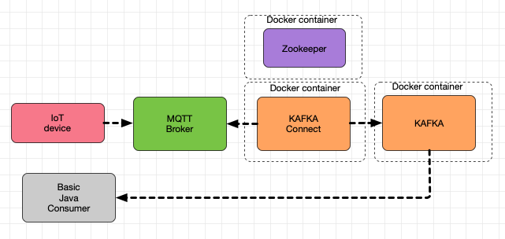
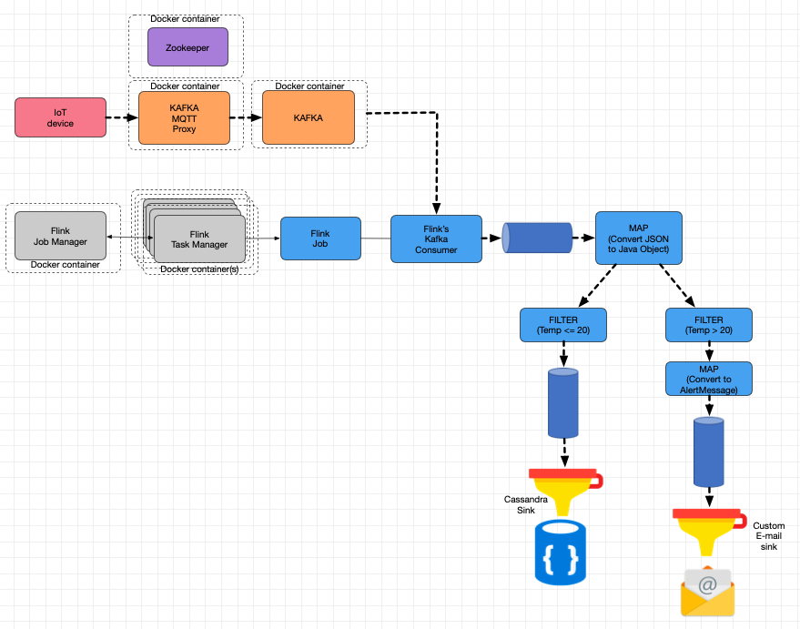

### Software Engineering for IoT and BigData
### Lab 4 - Data streams processing


In Lab-03, as depicted in the following diagram, you set up a basic data ingestion configuration (using Docker containers and Docker-compose), where the messages posted by the IoT devices to a cloud-based MQTT Broker, were pulled by Kafka-connect, and then forwarded to a Kafka topic. As a proof of concept, a basic Java-based kafka consumer was created.




In this exercise, instead of pulling data from a third-party MQTT broker, you will make use of a MQTT-Proxy running on KAFKA ([check the pros and cons of each approach](https://www.confluent.io/blog/iot-streaming-use-cases-with-kafka-mqtt-confluent-and-waterstream/)).  Furthermore, you will create a pipeline for processing the data stream created by the IoT devices, which -as mentioned before- will arrive at the KAFKA topic. To do so, you will setup a Flink cluster where the Flink job (a runtime representation of a dataflow graph) that will process the data published on the KAFKA topic will be deployed (by the [Job Manager](https://ci.apache.org/projects/flink/flink-docs-stable/concepts/glossary.html#flink-jobmanager)) and  executed (by the [Task manager](https://ci.apache.org/projects/flink/flink-docs-stable/concepts/glossary.html#flink-taskmanager)). Flink provides a wide variety of tools and techniques for DataStream processing. In this exercise you will compose a series of transformation functions to create the data pipeline (see figure below) as follows:

* The job deployed on the Job Manager, and executed by the available task managers, will create the 'input' DataStream from the KAFKA topic using the consumer provided by the Flink's API.
* A MAP function will convert the data received on this first DataStream (which is  the plain-text JSON posted by the IoT devices), in a Java Object.
* Two filters will be applied, in parallel, to the DataStream that results from the Map above described. One will filter the data with temperature readings above 20, and the other with readings below this value. The output of the first filter, in turn, will pass through another mapping function, which will turn all messages Java Objects into a different kind of object (AlertMessage), before ending in its Sink. The output of the second filter, on the other hand, will be connected directly to a Sink. For testing purposes, you will be using a 'Print Sink', that simply prints all the data from the DataStream on STDOUT. Once the configuration is working, you will replace these 'Print sinks' with a sink that sends email messages based on the 'high-temperature' readings, and a sink that makes the data from the 'low-temperature' readings persistent in a database.




### Part I. Setting up the services

1. Clone the project. It includes a basic Docker-compose configuration, with Kafka, Zookeeper and Kafka's MQTT proxy.

2. Check in the official documentation how to [setup a Flink's Session cluster with Docker-compose](https://ci.apache.org/projects/flink/flink-docs-stable/ops/deployment/docker.html#session-cluster-with-docker-compose). 

3. Add the *jobmanager* and *taskmanager* services to the provided *docker-compose.yml* file. In the sample configuration given in Flink's documentation, the Dockerhub image *flink:1.11.2-scala_2.11* is used. In this exercise you will use regular Java, so use the *flink:java8* image instead:

4. Do the following on the *jobmanager* service definition:

	* Make the service dependent on the kafka service.
	* [Add a volume](https://docs.docker.com/storage/volumes/#use-a-volume-with-docker-compose), so the Docker machine can access the JAR files, created on the host machine. For example, you can map the folder where the Maven project of the Flink job is located:

	```yaml
    volumes:
        - ./simple-flink-job:/jobs-jars	
	```

5. The environment variable *KAFKA\_MQTT\_TOPIC\_REGEX\_LIST* is not yet defined in the configuration of the *kafka-mqtt-proxy* service. It defines which MQTT topics -on the 'proxy' MQTT broker- will be mapped as a KAFKA topic. You can provide a list of mappings with the form *kafka-topic:mqtt-topic-regex*, where *mqtt-topic-regex* is a regular expression:

	```yaml
	KAFKA_MQTT_TOPIC_REGEX_LIST: 'kafka-topic1:mqtt-topc-regex1,kafka-topic2:mqtt-topc-regex2'
	```

	For example, with the following configuration, all the data posted to MQTT topics like */aaa/bbb/thetopic*, */xxx/thetopic*, etc, will be forwarded to Kafka's *my-k-topic*.

	```yaml
	KAFKA_MQTT_TOPIC_REGEX_LIST: 'my-k-topic:.*thetopic'
	```
	Choose a topic name for the data sent by your IoT device(s) and complete this configuration accordingly.

6. Start the docker-compose services. Use Docker's dashboard or [LazyDocker](https://github.com/jesseduffield/lazydocker) to make sure they are running correctly. 

7. Open a shell on the Kafka container and create the topic given the selected name on step 5.

8. In the same container, execute a [kafka-console-consumer](https://docs.cloudera.com/runtime/7.2.1/kafka-managing/topics/kafka-manage-cli-consumer.html). Using your IoT device, or any MQTT client like [MQTT-explorer](http://mqtt-explorer.com/) to post some messages. Make sure this part of the pipeline is working by checking that the messages are printed on the kafka-console-consumer.


### Part II. Writing Flink's job:

The Maven project in the *simple-flink-job* folder contains the basic elements of a Java program that defines the basic configuration of a Flink's Job, and creates the initial DataStream object (#1 in the second diagram). Add the code to create processing pipelines described in the exercise's introduction.

0. Change the first parameter used on the the FlinkKafkaConsumer constructor (THE-KAFKA-TOPIC) with the Kafka topic name defined in Part I.
1. Check Flink's [documentation on DataStream transformations](https://ci.apache.org/projects/flink/flink-docs-stable/dev/stream/operators/), especially the Map and Filter Operators.
2. Apply a *map* transformation to the data stream created for the Kafka topic, so it receives a String (the JSON documents posted by the IoT devices)  and return a Java Object. To do so:
	* Check how the [Jackson Object mapper works](https://www.baeldung.com/jackson-object-mapper-tutorial).
	* Create a POJO (Java class) compatible with the JSON documents the IoT device will send.
	* Check the [DataStream API](https://ci.apache.org/projects/flink/flink-docs-master/api/java/org/apache/flink/streaming/api/datastream/DataStream.html) to use the right Type parameters (T, R, etc).

3. Follow the same documentation to create the two 'temperature filters', and apply them on the DataStream that resulted from the *map* transformation in Step 2.
4. Set a [PrintSinkFunction]() as a sink to the DataStream that resulted from the 'low-temperature' filter.
5. Create a 'map' transformation for the DataStream that resulted from the 'high-temperature' filter. This transformation should turn the POJO defined by you, into an AlertMessage POJO (included in the project), with your email address as the recipient, and, as a message, something like *"Alert: high temperature - XX degrees, reported by device YYY"*. Add a PrintSinkFunction, in turn, to the DataStream created by this map transformation.

6. Build and package your project. Make note of the name of the JAR file created on the *target* folder that ends on '-with-dependencies.jar'. 

	```bash
		mvn package
	```

7. To deploy the JOB, open a shell on the *jobmanager* container. If you configured the *volumes* parameter correctly, you should be able to access the Maven project in the folder /jobs-jars, and hence the JAR created before should be accesible on /jobs-jars/target. If so, run the command *flink run* (adjusting the jar file name accordingly):

	```bash
		flink run -c edu.eci.isiot.flinkjobs.KafkaDataStreamSimpleJob /jobs-jars/target/THE-NAME-OF-YOUR-JAR-FILE-jar-with-dependencies.jar

	```
	Alternatively, you can use Flink's web UI, which should be accesible from the host at http://localhost:8081, to upload the JAR file.

8. Post some data to the MQTT-proxy as you did in the part I of the exercise (with values above and below 20). If everything is working correctly, you should see in the terminal where you started docker-compose, or in [the logs of the *taskmanager*](https://docs.docker.com/engine/reference/commandline/logs/) the messages of the two *PrintSinkFunction* sinks.

# Part III.

Update your system configuration so instead of just printing the data from the two ending DataStreams, you make something useful with it. 

1. Create a new type of Sink, which sends an email when receiving an AlertMessage object. You can do so by creating a class that extends the [RichSinkFunction class](https://ci.apache.org/projects/flink/flink-docs-release-1.9/api/java/org/apache/flink/streaming/api/functions/sink/RichSinkFunction.html) and overriding the *invoke* method. Add this custom sink ad the end of the DataStream with the AlertMessage objects (#3 in the diagram).

2. Make the output of the DataStream #2 (see diagram) persistent in a Cassandra database. To do so, add a [cassandra service to your Docker-compose configuration](https://hub.docker.com/r/bitnami/cassandra/), and check how the [*CassandraSink*](https://ci.apache.org/projects/flink/flink-docs-stable/dev/connectors/cassandra.html) works. 

